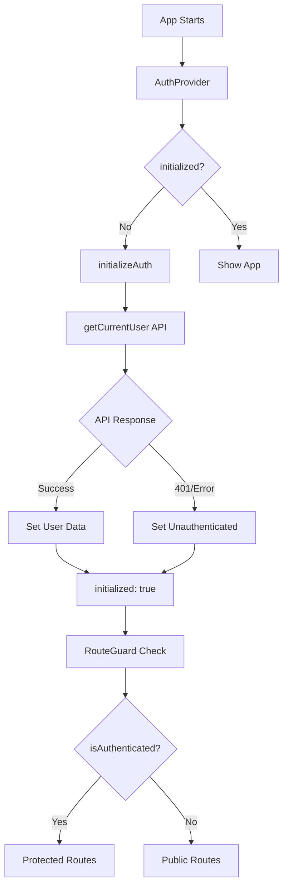

# fin-folio-client

A modern financial portfolio management application built with React, TypeScript, and Redux Toolkit.

## 🏗️ Architectural Layers

```
┌─────────────────────────────────────┐
│         COMPONENTS                  │  (UI)
│  - LoginForm, Dashboard, etc.       │
└─────────────────┬───────────────────┘
                  │ dispatch / call
                  ↓
┌─────────────────────────────────────┐
│    STATE MANAGEMENT                 │  (State)
│  Redux Thunks OR React Query        │
└─────────────────┬───────────────────┘
                  │ calls
                  ↓
┌─────────────────────────────────────┐
│         SERVICES                    │  (Business Logic)
│  - authService.signIn()             │
│  - userService.updateProfile()      │
└─────────────────┬───────────────────┘
                  │ calls
                  ↓
┌─────────────────────────────────────┐
│         API BASE                    │  (HTTP Layer)
│  - apiPost, apiGet, etc.            │
└─────────────────┬───────────────────┘
                  │ HTTP
                  ↓
           🌐 BACKEND API
```

Each layer has a purpose:

- **Components** = UI + user interaction
- **State Management** = Cache + loading states
- **Services** = Business logic + API orchestration ← THIS IS KEY
- **API Base** = HTTP infrastructure

---

## 🔐 Authentication System

The Raven application implements a robust authentication system with cookie-based sessions, automatic token refresh, and optimized initialization flow.

### Authentication Flow Overview



### Key Components

#### 1. **AuthProvider** (`/components/AuthProvider.tsx`)

- **Purpose**: Handles authentication initialization at app startup
- **Features**:
  - Single initialization call (prevents duplicate API requests)
  - Loading state management during initialization
  - Global state coordination

```typescript
// Prevents multiple initializations
const hasDispatched = useRef(false);

useEffect(() => {
  if (!initialized && !hasDispatched.current) {
    hasDispatched.current = true;
    dispatch(initializeAuth());
  }
}, [dispatch, initialized]);
```

#### 2. **Auth Slice** (`/store/slices/authSlice.ts`)

- **Purpose**: Centralized authentication state management
- **State Structure**:
  ```typescript
  interface AuthState {
    user: AuthUser | null;
    isAuthenticated: boolean;
    initialized: boolean; // Has initialization been attempted?
    initializing: boolean; // Is initialization in progress?
    loading: boolean; // Is an auth operation in progress?
    error: string | null;
  }
  ```

#### 3. **RouteGuard** (`/components/routes/RouteGuard.tsx`)

- **Purpose**: Protects routes based on authentication status
- **Logic**:
  - Waits for `initialized: true` before making routing decisions
  - Redirects unauthenticated users to login
  - Redirects authenticated users away from auth pages

#### 4. **useAuth Hook** (`/hooks/useAuth.ts`)

- **Purpose**: Provides authentication utilities to components
- **Features**:
  - Login/logout functions
  - Manual session refresh
  - Error handling with toast notifications

### Authentication States

| State               | `initialized` | `isAuthenticated` | `initializing` | UI Behavior            |
| ------------------- | ------------- | ----------------- | -------------- | ---------------------- |
| **App Starting**    | `false`       | `false`           | `false`        | Show loading spinner   |
| **Checking Auth**   | `false`       | `false`           | `true`         | Show "Initializing..." |
| **Authenticated**   | `true`        | `true`            | `false`        | Show protected app     |
| **Unauthenticated** | `true`        | `false`           | `false`        | Show login page        |

---

## Redux Async Thunks with `createAppAsyncThunk`

### What is `createAppAsyncThunk`?

A typed wrapper around Redux Toolkit's `createAsyncThunk` that includes our app's `RootState` and `AppDispatch` types.

```typescript
export const createAppAsyncThunk = createAsyncThunk.withTypes<{
  state: RootState;
  dispatch: AppDispatch;
}>();
```

### Anatomy of an Async Thunk

```typescript
export const signIn = createAppAsyncThunk(
  "auth/signIn", // ← Type Prefix
  async (credentials: LoginDto, { rejectWithValue }) => {
    // ← Payload Creator
    try {
      const response = await authService.signIn(credentials);
      return response.user; // ← Fulfilled payload
    } catch (error) {
      return rejectWithValue(error); // ← Rejected payload
    }
  }
);
```

### 1. Type Prefix: `"auth/signIn"`

This string automatically generates **3 action types**:

- `"auth/signIn/pending"` - Dispatched when async operation starts
- `"auth/signIn/fulfilled"` - Dispatched when operation succeeds
- `"auth/signIn/rejected"` - Dispatched when operation fails

### 2. Payload Creator Callback

**When is it called?**

```typescript
// Dispatch from component
dispatch(signIn({ email: "user@example.com", password: "pass123" }));
```

**What it receives:**

- First argument: `credentials` (what you passed to dispatch)
- Second argument: `thunkAPI` object with utilities like `rejectWithValue`, `getState`, `dispatch`

**What it returns:**

- Success: Return value becomes `action.payload` in fulfilled action
- Error: `rejectWithValue(error)` becomes `action.payload` in rejected action

### 3. `rejectWithValue(error)` - Why Use It?

**Without `rejectWithValue`:**

```typescript
catch (error) {
  throw error;  // Redux wraps this
}
// Result in reducer:
// action.payload = undefined
// action.error = { message: "Request failed", name: "Error" }
```

**With `rejectWithValue`:**

```typescript
catch (error) {
  return rejectWithValue(error);  // You control the payload
}
// Result in reducer:
// action.payload = error (your full ApiError object)
// Can access: error.message, error.status, error.data
```

**Benefits:**

- Access custom error properties (status code, validation errors, etc.)
- Return structured error data to UI
- Type-safe error handling

### Complete Execution Flow

```typescript
// Step 1: User action triggers dispatch
dispatch(signIn({ email: "user@example.com", password: "pass123" }))

// Step 2: "auth/signIn/pending" action dispatched immediately
// State updates:
// { loading: true, error: null }

// Step 3: Callback executes
await authService.signIn(credentials)
  ↓
await apiPost("/api/v0/auth/login", credentials)
  ↓
HTTP POST to backend

// Step 4a: SUCCESS PATH
// Returns: { user: { id: 1, name: "John" }, token: "abc123" }
// Token saved to sessionStorage
// "auth/signIn/fulfilled" action dispatched
// State updates:
// { user: { id: 1, name: "John" }, loading: false, isAuthenticated: true }

// Step 4b: ERROR PATH
// API returns: { message: "Invalid credentials", status: 401 }
// rejectWithValue(error) called
// "auth/signIn/rejected" action dispatched
// State updates:
// { error: "Invalid credentials", loading: false }
```

### `initialized` and `isAuthenticated` states in the auth store slice

```
initialized = "Have we TRIED to check auth?" (yes/no)
isAuthenticated = "Did we FIND a valid session?" (yes/no)
```

Both need to be true for different reasons:
`initialized: true, isAuthenticated: true` → Show app
`initialized: true, isAuthenticated: false` → Show login
`initialized: false` → Show loading (don't know yet)

## Forgot Password Flow

```
Forgot Password Flow:
┌─────────────────┐    ForgotPasswordDto    ┌──────────────────┐
│ "Forgot Password"│ ──────────────────────► │ Send Reset Email │
│ (enter email)   │                         │ (with token)     │
└─────────────────┘                         └──────────────────┘
                                                      │
                                                      ▼
┌─────────────────┐    ResetPasswordDto     ┌──────────────────┐
│ "Reset Password"│ ◄────────────────────── │ Email Link Click │
│ (enter new pwd) │                         │ (contains token) │
└─────────────────┘                         └──────────────────┘

Alternative - Change Password (logged in):
┌─────────────────┐    ChangePasswordDto    ┌──────────────────┐
│ "Change Password"│ ──────────────────────► │ Update Password  │
│ (current + new) │                         │ (authenticated)  │
└─────────────────┘                         └──────────────────┘
```

## API & TypeScript Notes

### Index Signatures

- `[key: string]: unknown` lets an interface accept any additional string-keyed properties.
- Use it when you expect extra fields but don’t want TypeScript to infer their shape.

### Axios Error Anatomy

- `axiosError.response`: The server replied with a non-2xx status. Includes `status`, `headers`, and the response body.
- `axiosError.request`: The request was sent but no response arrived (network issues, timeouts).

### REST Verb Cheatsheet

- `GET`: Retrieve existing data without modifying state.
- `POST`: Create new resources or trigger server-side actions.
- `PUT`: Replace the entire resource with a new representation.
- `PATCH`: Apply a partial update; send only the fields that change.
- `DELETE`: Remove the resource.

### PUT vs PATCH

- `PUT` treats omitted fields as missing and often resets them—send the full payload.
  - PUT replaces the resource's entire representation at the target URI.
    Whatever fields you omit are treated as missing and may be reset/removed. Think “complete update.”
- `PATCH` merges provided fields into the existing resource—ideal for targeted edits.
  - PATCH applies a partial update. You send only the fields to change (often in JSON Patch or a custom schema), and the server merges them into the existing resource.

### Utility Types: Pick & Partial

- `Pick<T, K>` creates a type with only the keys listed in `K`. We use it to derive an `AuthUser` subset from the full `User` model:
  - `type AuthUserRequiredFields = Pick<User, "id" | "name" | "email">;`
- `Partial<T>` keeps the same properties but makes them optional. Layering it lets us mark optional profile fields while reusing `User`'s types:
  - `type AuthUserOptionalFields = Partial<Pick<User, "avatarUrl" | "country" | "currency">>;`
- Combining the two keeps auth responses lightweight yet type-safe:
  - `export type AuthUser = AuthUserRequiredFields & AuthUserOptionalFields;`

### What createAsyncThunk (and withTypes) actually does

Normally, Redux Toolkit's `createAsyncThunk` is generic, meaning it supports up to three type parameters:

`createAsyncThunk<Returned, ThunkArg, ThunkApiConfig>(type, payloadCreator)`

You can specialize each of these generics to get perfect typing for:

- What the thunk returns

- What the thunk receives as an argument

- What the thunk API looks like (e.g., types for `dispatch`, `state`, and `rejectValue`)

1. `Returned`: `{ user: User; message: string; success: boolean }`

This is the resolved value of the thunk —
what your async function returns on success (and what ends up in `action.payload` for the `fulfilled` case).

Example:

```ts
dispatch(signIn(credentials))
  .unwrap()
  .then((result) => {
    // result is of type: { user: User; message: string; success: boolean }
  });
```

So, when your thunk finishes successfully, it dispatches a `signIn/fulfilled` action with a payload of that type.

2. `ThunkArg`: `LoginDto`

This is the input argument the thunk accepts when dispatched.

```ts
dispatch(signIn({ email: "a@b.com", password: "123" }));
```

Here, `{ email, password }` must conform to the `LoginDto` interface — that's your payload creator argument type.

3. `ThunkApiConfig`: `{ rejectValue: ApiError }`

This third type parameter is extra config for the thunk's internal API.

By default, `createAsyncThunk` provides:

```ts
(
  payload: ThunkArg,
  thunkAPI: { dispatch; getState; rejectWithValue; requestId; signal }
) => Promise<Returned>;
```

But you can customize what's inside `thunkAPI` using the third generic.
In your case:

{ rejectValue: ApiError }

means:

`rejectWithValue()` can only accept an `ApiError` object.

The rejected action (`signIn/rejected`) will carry a `.payload` of type `ApiError` if you call `rejectWithValue()`.

So this:

```ts
return rejectWithValue(error as ApiError);
```

means your `signIn.rejected` action will have a `.payload` like:

```ts
{
  type: "auth/signIn/rejected",
  payload: ApiError // ✅ correctly typed
}
```

without losing type safety.
